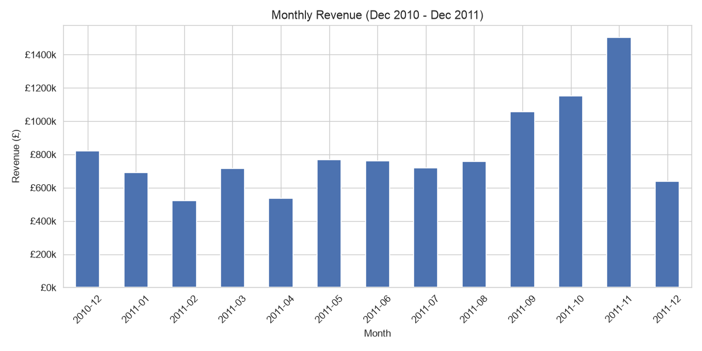

# Sales Performance Analysis

Exploratory analysis of 525K UK online retail transactions, uncovering seasonality, revenue concentration, and a hidden data quality issue that would have skewed the results.



## Problem / Motivation

A gift/novelty retailer wants to understand its own sales data before making decisions about inventory, marketing spend, and staffing. This project answers four concrete questions from one year of real transaction data: Is revenue seasonal? Which markets and products actually drive revenue? How concentrated is that revenue across the product catalog? And are there weekday patterns worth planning around?

## Key Findings

- **Strong pre-Christmas seasonality** — revenue nearly doubles from August (£758k) to November (£1.50M).
- **UK-dominated business** — 84.6% of all revenue comes from the UK; no other single country exceeds 3%.
- **Moderate revenue concentration** — about 21% of products (≈828 of ~4,000) generate 80% of total revenue.
- **A misleading "bestseller"** — without filtering, a shipping fee ("DOTCOM POSTAGE") would rank as the #1 product by revenue. Excluding non-product line items reveals the real top seller: the Regency Cakestand 3 Tier (£174k).
- **A data quality finding, not a business one** — the dataset contains zero Saturday transactions across the entire year, almost certainly a gap in how the data was extracted rather than real customer behavior.

## Tech Stack

- Python 3, pandas, matplotlib, seaborn
- Jupyter Notebook for the full analysis workflow
- Data source: [UCI Machine Learning Repository](https://archive.ics.uci.edu/dataset/352/online+retail)

## How it works

The analysis is split into four notebooks, each building on the last:

1. **`01_data_exploration.ipynb`** — load the raw data, understand columns, spot data quality issues.
2. **`02_data_cleaning.ipynb`** — remove duplicates and invalid rows with documented reasoning, separate returns from completed sales, compute `Revenue`.
3. **`03_univariate_analysis.ipynb`** — examine price, quantity, revenue, and country distributions on their own before combining them.
4. **`04_business_analysis.ipynb`** — answer the business questions above with 5 charts.

```
Raw Excel data → Clean → Explore each variable → Business charts → Findings
```

## Getting Started

```bash
git clone https://github.com/Tanos3000/sales-performance-analysis.git
cd sales-performance-analysis
python3 -m venv venv
source venv/bin/activate
pip install -r requirements.txt
python download_data.py       # downloads the dataset into data/
jupyter notebook               # then run the notebooks in order, 01 to 04
```

## Data Source

[UCI Online Retail Dataset](https://archive.ics.uci.edu/dataset/352/online+retail) — 541,909 real transactions from a UK-based online gift retailer, December 2010 to December 2011. Licensed under CC BY 4.0, free to use.

## What I learned

Cleaning decisions matter more than I expected — the "top product" chart would have been wrong (a shipping fee, not merchandise) if I hadn't checked what was actually behind each `StockCode` first. I also learned to trust the median over the mean for skewed data like this, and that a chart showing something *missing* (no Saturday orders) can be as important a finding as a chart showing a trend.
